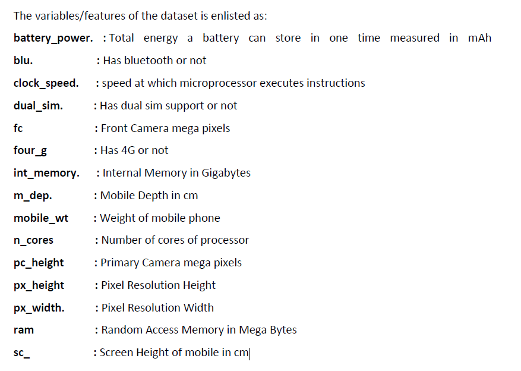
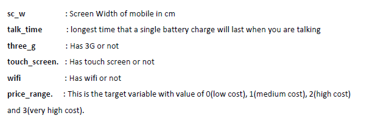
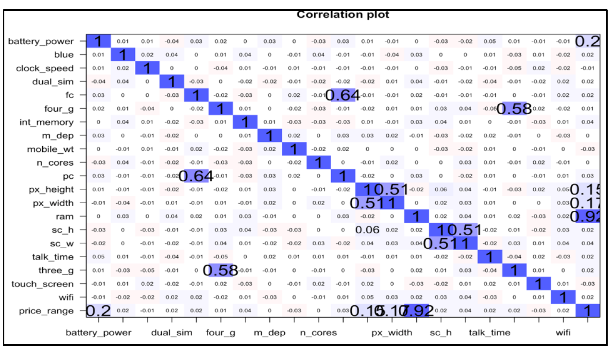
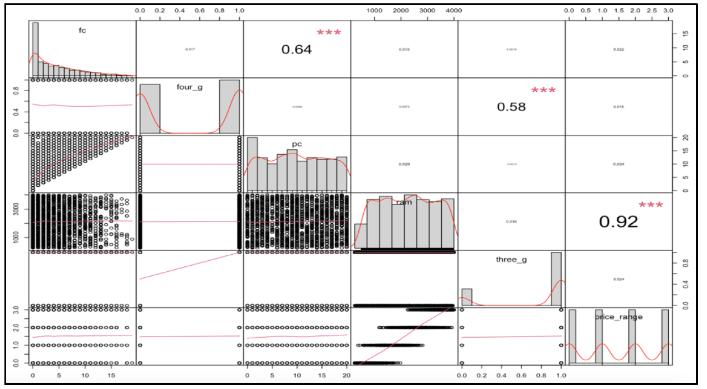
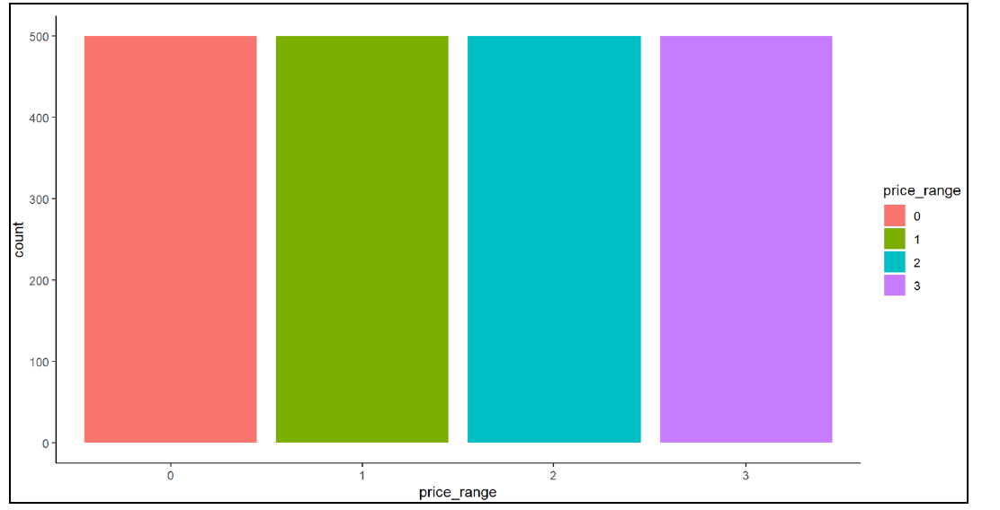
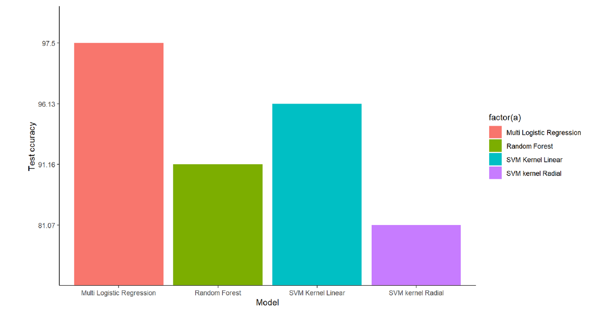

# Mobile_Price_Classification
 Masters Statistic Course Final Project

Perform Machine Learning algorithms and build models to classify the price range of the mobiles for the data given in the Kaggle dataset.
The “Mobile Price Classification” dataset was downloaded from Kaggle. The objective of this project is to understand the dataset and build machine learning models to classify the price range of the mobile phones. Mobile prices depend upon several factors such as the Manufacturing costs, geographical location of the market, competitor product price, local taxation rates, profit margin, technical specifications, etc. This dataset consists of only the technical specification of the mobile phone which has a bearing on the price of the mobile phone.
The dataset was studied using the programming language R. The data was visualized using different plots and then various exploratory data analysis (EDA) techniques were performed on the dataset to understand the data. After EDA, four machine learning models were built followed by computing the accuracy rate of each model. Then all the models were compared and the model with the best accuracy rate was selected.

# EDA 

The next step of the EDA was data cleaning. The NA values/ missing values were checked. There was no NA value in the dataset. The output below shows the first ten values of the entire ouput. The FALSE values indicate that there are no NA values in the dataset. Also a sum() was read to calculate the total NA values in the dataset. It indicated a 0 response and hence there was NA value in the dataset.

# Corelaion Plots 

# Response Distribution Check 

# Final Result - Best Model 

